# JackedLog

<p align="center">
  
</p>

<p align="center">
  <strong>A lightning-fast, offline-first fitness tracker built with Flutter</strong>
</p>

<p align="center">
  Track progressive overload, hit PRs, and visualize your gains.
  <br>
  <strong>Completely free. No premium tiers. No BS.</strong>
</p>

<p align="center">
  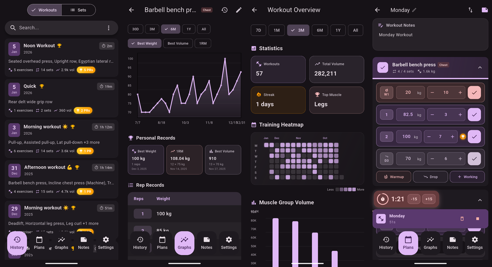
</p>

---

## Why JackedLog?

- **🎯 100% Free Forever**: No ads, no subscriptions, no premium tiers. Every feature unlocked.
- **✈️ Offline-First**: Pure SQLite—no internet, no servers, no data mining. Train anywhere.
- **🎊 PR Celebrations**: Automatic detection with animated confetti when you hit new maxes.
- **📊 Advanced Analytics**: Training heatmaps, muscle group charts, and progressive overload tracking.
- **🎨 Full Customization**: Artistic color picker lets you personalize the entire app theme.
- **📱 Cross-Platform**: Android, iOS, Linux, macOS, Windows—your data follows you everywhere.

---

## Screenshots

### Workout Execution & Tracking
<p align="center">
  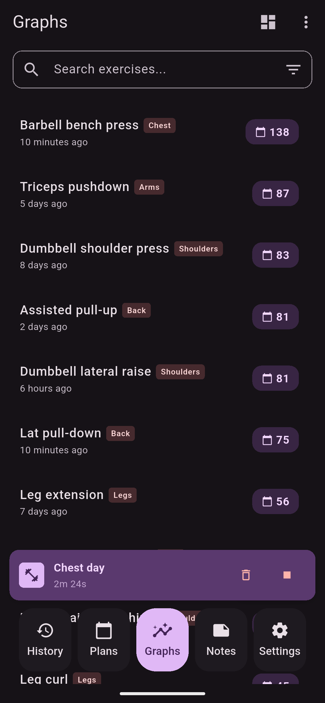
  
  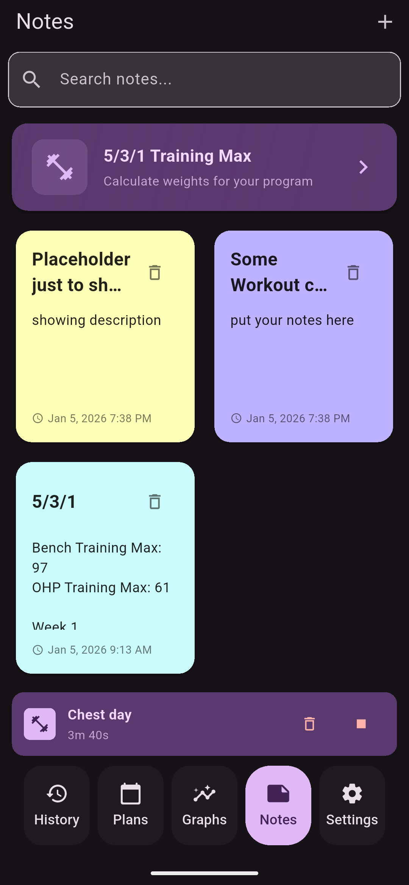
</p>

*Exercise list, active workout page, and exercise notes*

### Personal Records & Celebrations
<p align="center">
  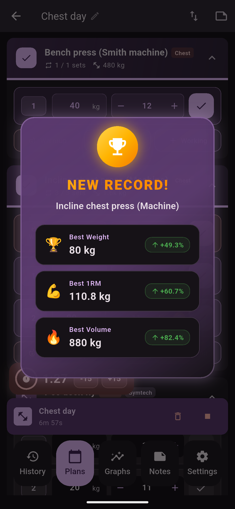
  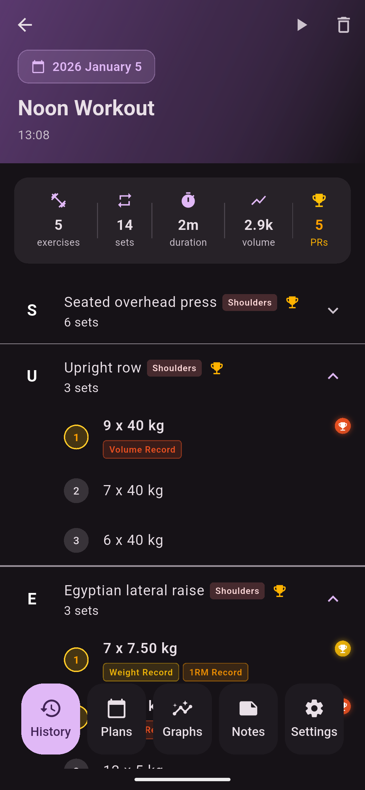
  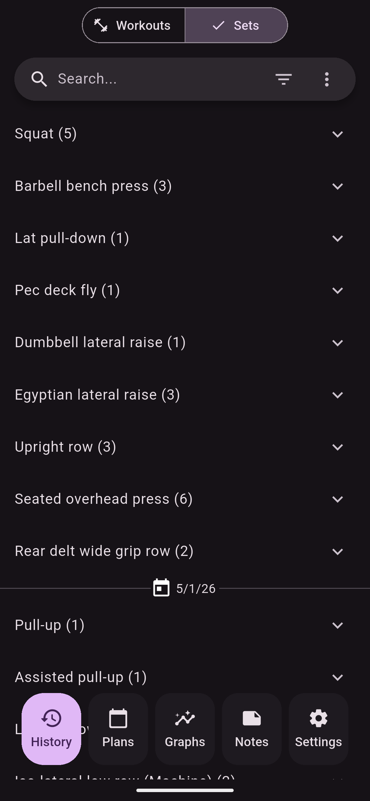
</p>

*PR celebrations, history workouts and sets*

### Training Overview & Heatmap
<p align="center">
  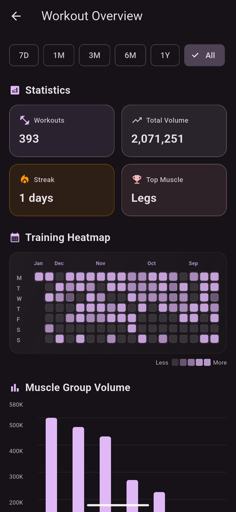
  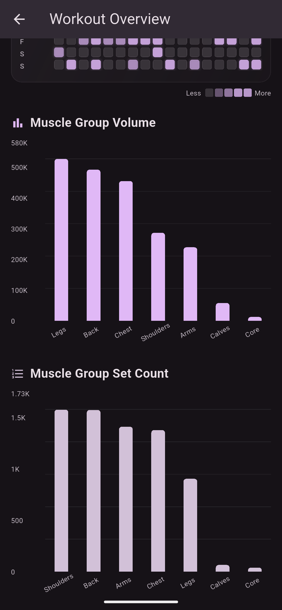
  
  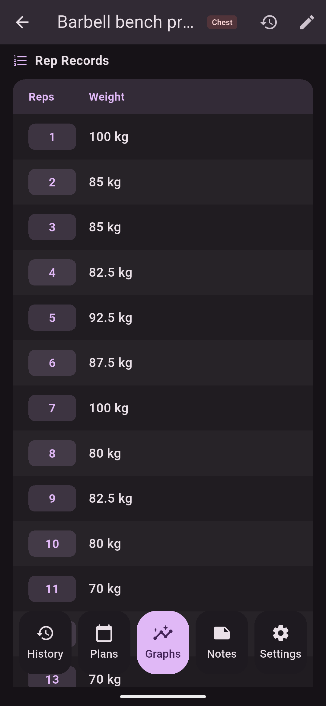
</p>

*Overview period stats and calendar, muscle group analytics, detailed exercise graphs and reptition records*

### Custom Theming and Settings
<p align="center">
  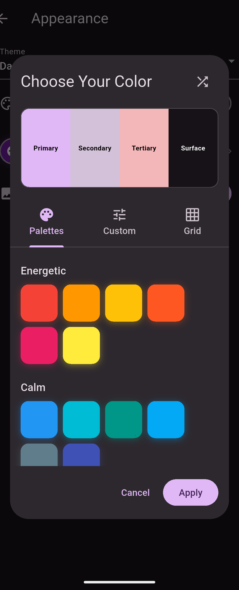
  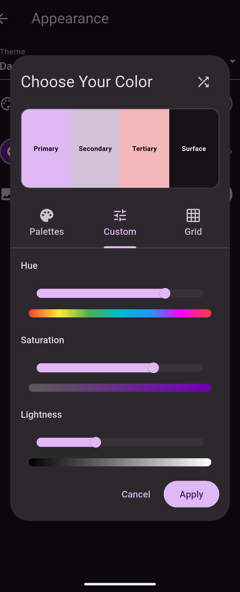
  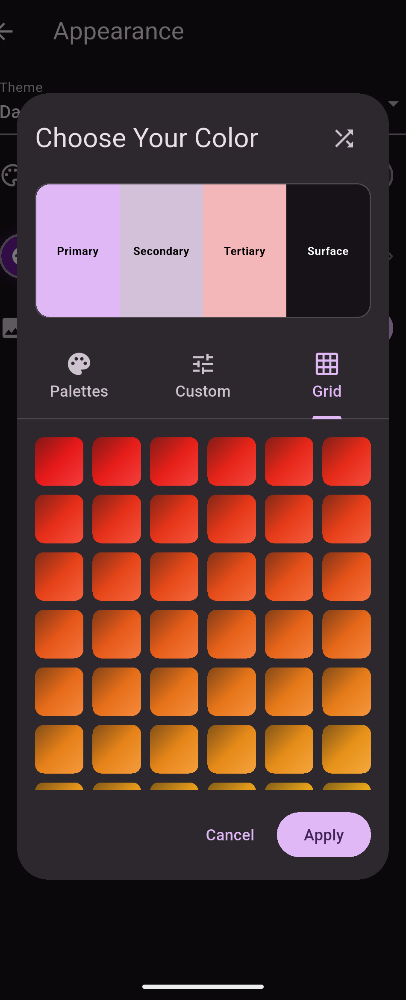
  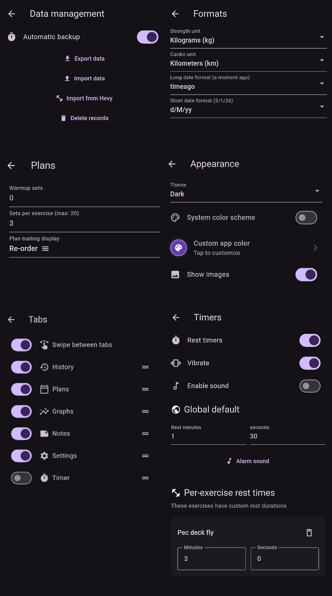
</p>

*Custom app color picker, Material Design 3 themes, Settings*


### Planning & Templates
<p align="center">
  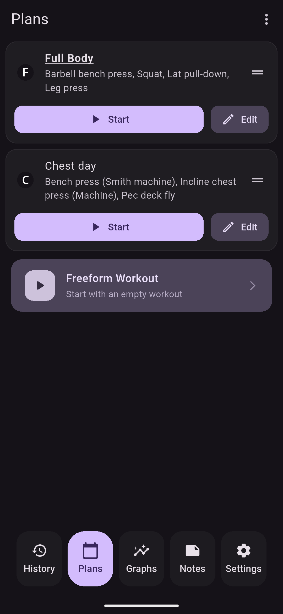
  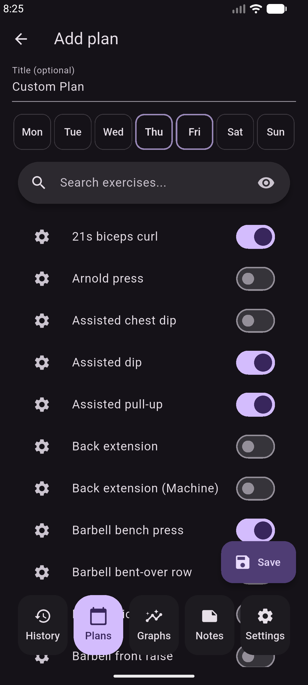
  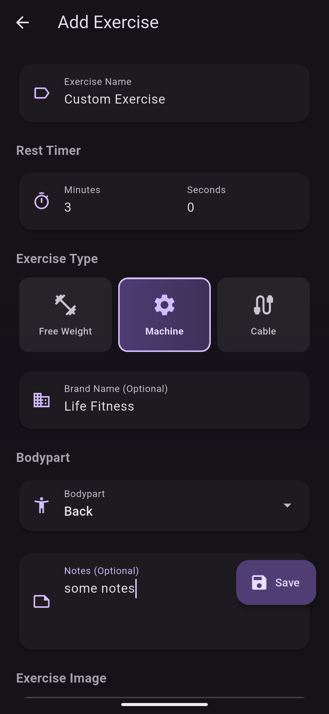
  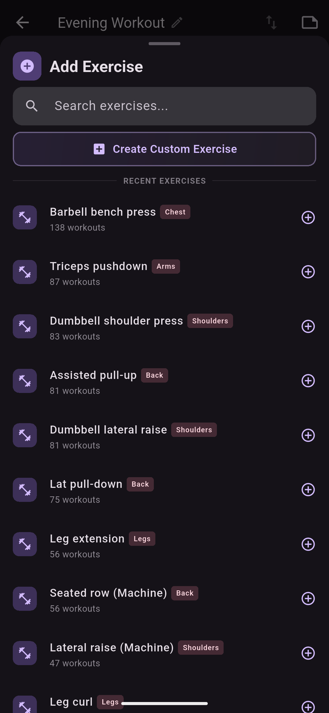
</p>

*Customizable Training plans, Custom exercises and add them on the fly*

---

## Features

### 🏋️ Workout Management

- **Session Tracking**: Group exercises into training sessions with start/end timestamps, with floating indicator showing current session
- **Resume Workouts**: Pick up where you left off—even resume past workouts for edits
- **Training Plans & Templates**: Pre-built splits or freeform workouts
- **Exercise Reordering**: Drag-and-drop to reorganize your training on the fly, with exercise and sets removal on the fly
- **Exercise Notes**: Add training notes, cues, and form reminders during sessions
- **Warmup and Drop Sets**: Mark warmup and drop sets separately from working sets with distiunct visual indicators
- **Drop Sets**: Track drop sets with distinct visual indicators

### 📈 Performance Tracking

- **Personal Records**: Tracks best 1RM (Brzycki formula), best volume, and best weight per exercise
- **Custom Celebrations**: Animated notifications with confetti and improvement percentages when you break records
- **Progressive Overload Charts**: Visualize strength gains over time with detailed graphs, with period-based stats 
- **Training Heatmap**: GitHub-style activity calendar showing consistency and adherence
- **Muscle Analytics**: Top muscle groups by volume and set count

### 🔧 Additional Tools

- **5/3/1 Programming**: Built-in calculator for Wendler's 5/3/1 methodology with training max tracking
- **Hevy Import**: Migrate your entire training history from Hevy seamlessly
- **Custom Rest Timers**: Set per-exercise rest periods with audio and haptic feedback
- **Exercise Categories**: Organize exercises by muscle group, type (free weight, machine, cable) and brand (Hammer Strength, etc.)
- **Notes System**: Separate notes feature for training programs, diet plans, etc.


## Tech Stack

| Layer            | Technology                  |
| ---------------- | --------------------------- |
| Framework        | Flutter (Dart SDK >= 3.2.6) |
| Database         | Drift 2.28.1 (SQLite ORM)   |
| State Management | Provider 6.1.1              |
| Charts           | fl_chart                    |
| Design           | Material Design 3           |
| Theming          | dynamic_color package       |


## Getting Started

### Prerequisites

- Flutter SDK (3.2.6 or higher)
- Dart SDK (included with Flutter)
- For development: Android Studio / VS Code / IntelliJ IDEA

### Installation

1. **Clone the repository**

   ```bash
   git clone https://github.com/Aquatictw/JackedLog jackedlog
   cd jackedlog
   ```

2. **Install dependencies**

   ```bash
   flutter pub get
   ```

3. **Generate database code** (if needed)

   ```bash
   dart run build_runner build --delete-conflicting-outputs
   ```

4. **Run the app**

   ```bash
   # Debug mode
   flutter run

   # Release mode 
   flutter run --release
   ```


- **Offline-First**: Data stored locally in SQLite—zero network dependency
- **Provider Pattern**: Global state management for active workouts and timers—seamless UX
- **Migration System**: Schema versioning (currently v55) with step-by-step migrations—data integrity guaranteed

See [CLAUDE.md](CLAUDE.md) for complete schema documentation.

---

### Contributing

Contributions are welcome! This is an open-source project and improvements are always appreciated.

### Acknowledgments

> This project is based on [brandonp2412/JackedLog](https://github.com/brandonp2412/JackedLog) and has been heavily modified and rebuilt with new architecture and features.

### License

JackedLog is licensed under the [MIT License](LICENSE.md).


<p align="center">
  <strong>Built for lifters, by lifters.</strong>
  <br>
  100% free. No ads. No subscriptions. No cloud dependency.
  <br>
  Just pure tracking for serious gains.
</p>

<p align="center">
  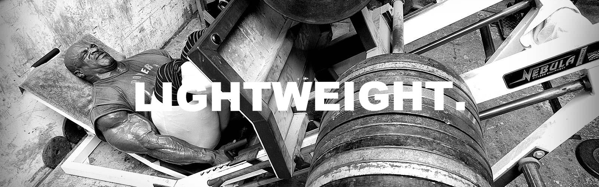
</p>
