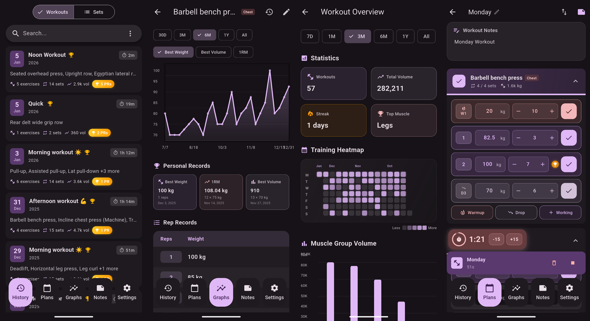

# JackedLog

<p align="center">
  
</p>

<p align="center">
  <strong>A lightning-fast, offline-first fitness tracker built with Flutter</strong>
</p>

<p align="center">
  Track progressive overload, hit PRs, and visualize your gains.
  <br>
  <strong>Completely free. No premium tiers. No BS.</strong>
</p>

<p align="center">
  
</p>

---

## Screenshots

<p align="center">
  
  
  
  
  
</p>

*History, plans, training overview, bodyweight tracking, settings*

## Features

- **Workout tracking** — sessions with start/end times, resumable workouts, drag-and-drop exercise reordering, warmup and drop sets, per-exercise notes
- **Personal records** — best weight, volume, and 1RM (Brzycki) per exercise, with confetti celebrations when you break one
- **Analytics** — progressive overload graphs, GitHub-style training heatmap, muscle group volume breakdowns, bodyweight trends
- **Plans** — pre-built splits or custom templates, plus a built-in 5/3/1 calculator with training max tracking
- **Tools** — plate calculator, per-exercise rest timers, Hevy import, color-coded notes
- **Offline-first** — everything lives in a local SQLite database. No account, no network, no data mining
- **Theming** — Material Design 3 with a full custom color picker

## Development

Requires the Flutter SDK (3.2.6+).

```bash
git clone https://github.com/Aquatictw/JackedLog jackedlog
cd jackedlog
flutter pub get
flutter run
```

If you change the database schema, regenerate the Drift code:

```bash
dart run build_runner build --delete-conflicting-outputs
```

Migrations are written by hand (schema version 73) — see `lib/database/database.dart`.

### Regenerating README screenshots

With an Android device connected over adb:

```bash
./scripts/readme-screenshots
```

This runs an integration test (`integration_test/readme_screenshots_test.dart`) that seeds a throwaway on-device database with demo data, walks through the app, and writes `screenshots/readme_*.png`. Your real app data is untouched.

## Tech stack

Flutter, Drift (SQLite), Provider, fl_chart, Material Design 3.

## Acknowledgments

> This project is based on [brandonp2412/Flexify](https://github.com/brandonp2412/Flexify) and has been heavily modified and rebuilt with new architecture and features.

## License

JackedLog is licensed under the [MIT License](LICENSE.md).

<p align="center">
  <strong>Built for lifters, by lifters.</strong>
  <br>
  100% free. No ads. No subscriptions. No cloud dependency.
  <br>
  Just pure tracking for serious gains.
</p>

<p align="center">
  
</p>
